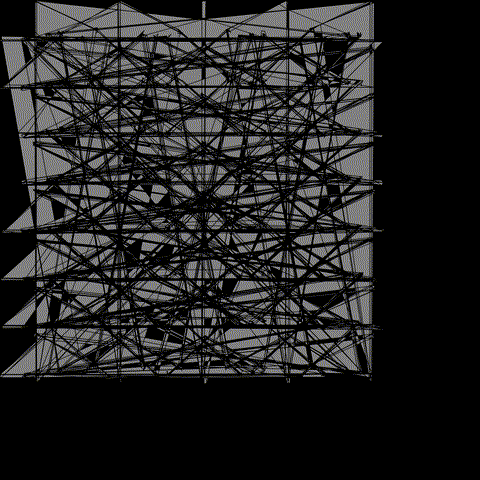

# Coser 1.0

This is my first attempt at using the [weir](https://github.com/inconvergent/weird) generative art library, and one that I recently learned is now considered archived. Therefore, this is the only generative art that will use this one.

This is also my first attempt at using Common Lisp. Definitely am still learning how to better weild the language, and made some lazy decisions along the way as I was learning.

## The Idea - Noise Spreading

This design comprises a few simple ideas to create something interesting.

1. Use a simple graph function. In this case, I chose `f(x) = cos(x)`
1. Generate `x-count` number of points to plot.
1. Add noise! For each point, generate a bunch of related points `spread-count` with the max spread of `min` and `max`.
1. Add more noise! Ensure all points fall with a given `modulo`, so spread points and graphs continuing cycle back into itself.
1. Duplicate the graph by shifting along the y-axis `y-count` number of times.
1. (Experimental) Generate `i-count` iterations of the graph, and maybe combine them all into a single gif to see how the rng effects the graph.

## Examples

The idea is simple, and leads to some surprisingly fun outputs. Below is one output I am fond of.

There are still quirks in the implementation, and I would like to better design this system using the updated library.

Another output as a gif I generated is as below. You can see how the RNG of the spread makes the graph breathe.

